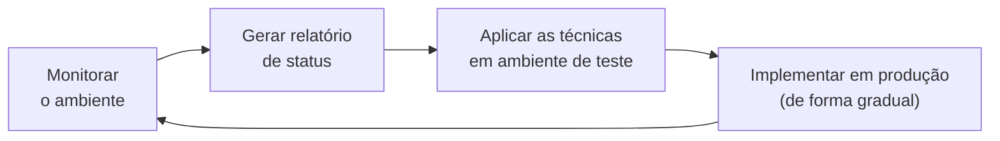

# SQL Server Developer — Tuning: Códigos com Máximo Desempenho

[← Voltar a SQL Server Developer](https://github.com/joycequoos/SQL-Server-Developer_ProgramacaoTotalStoredProcedure/blob/main/README.md)

Introdução ao tuning (ajuste de desempenho) no SQL Server: por que o tempo de resposta das consultas importa, quais fatores mais impactam a performance de um banco de dados e qual o ciclo de trabalho recomendado para buscar — e manter — um bom desempenho.

## Índice

- [Por que aprender sobre Tuning de SQL](#por-que-aprender-sobre-tuning-de-sql)
- [Fatores que afetam o desempenho](#fatores-que-afetam-o-desempenho)
  - [Nível de código e desenho de banco](#nível-de-código-e-desenho-de-banco)
  - [Infraestrutura](#infraestrutura)
  - [Crescimento e uso](#crescimento-e-uso)
- [O ciclo de tuning](#o-ciclo-de-tuning)
- [Módulos do curso](#módulos-do-curso)
- [Próximos passos](#próximos-passos)

---

## Por que aprender sobre Tuning de SQL

O tempo de resposta das consultas realizadas no banco de dados afeta diretamente a experiência de quem usa a aplicação. Vários fatores — de código mal escrito a hardware mal dimensionado — podem contribuir para um desempenho ruim, e saber identificá-los é o que permite agir sobre a causa real do problema, em vez de tentar "resolver na sorte".

## Fatores que afetam o desempenho

### Nível de código e desenho de banco

| # | Fator |
| --- | --- |
| 1 | Instruções mal escritas ou que não seguem boas práticas de desenvolvimento |
| 2 | Colunas mal definidas ou ocupando espaço desnecessário |
| 3 | Banco de dados alocado em um único disco, concorrendo com o sistema operacional e outros aplicativos |
| 4 | Tabelas sem índices, ou com índices mal dimensionados ou obsoletos |
| 5 | Conversão de dados desnecessária |

### Infraestrutura

| # | Fator |
| --- | --- |
| 1 | Hardware mal dimensionado |
| 2 | Instalação e configuração do sistema operacional |
| 3 | Dimensionamento errado do conjunto de discos usado para armazenamento |
| 4 | Instalação e configuração do gerenciador de banco de dados |

### Crescimento e uso

| # | Fator |
| --- | --- |
| 1 | Aumento da massa de dados |
| 2 | Aumento das conexões e usuários das aplicações |
| 3 | Aumento no número de bancos de dados compartilhando o mesmo servidor |

## O ciclo de tuning

> Tuning não é uma ciência exata — mas alguns procedimentos ajudam a buscar (e manter) um bom desempenho de forma consistente.

O ciclo é contínuo: monitorar → gerar relatório de status → testar as técnicas em ambiente de teste → implementar em produção aos poucos → e recomeçar periodicamente, já que o volume de dados, conexões e uso do banco muda constantemente.

## Módulos do curso

O curso segue explorando configurações do ambiente, monitoramento de comandos, consulta ao plano de execução, criação de bancos, tabelas e índices eficientes, entre outros tópicos:

| Módulo | Tópico |
| --- | --- |
| [1. Downloads e instalações do SQL Server, SSMS](https://github.com/JosiTubaroski/Preparando_Ambiente/blob/main/README.md) | Preparação do ambiente |
| [2. Sobre o SQL Server Management Studio, download e restore de base](https://github.com/JosiTubaroski/SQL_Server_Manag_Studio) | Ferramenta de gerenciamento e restauração de backup |
| [3. Onde os dados repousam / Memória da instância do SQL](https://github.com/JosiTubaroski/-Onde_dados_repousam.-) | Armazenamento em disco e uso de memória pela instância |
| [4. Design / Armazenamento e tipos de dados / Desempenho / Árvore balanceada](https://github.com/JosiTubaroski/Design-de-Banco-de-Dados) | Modelagem de dados e estrutura de índices (B-Tree) |
| [5. Armazenamento de dados](https://github.com/JosiTubaroski/P-ginas-de-Dados/) | Páginas de dados e organização física do armazenamento |

## Próximos passos

- Explorar `SET STATISTICS IO ON` e `SET STATISTICS TIME ON` para medir o custo real de uma consulta antes e depois de uma otimização.
- Praticar a leitura do plano de execução (`Execution Plan`) para identificar table scans, índices ausentes e operações custosas.
- Testar a criação de índices em colunas usadas com frequência em `WHERE`, `JOIN` e `ORDER BY`, e medir o impacto no tempo de resposta.
- Documentar um checklist de tuning aplicável antes de subir uma mudança para produção.
